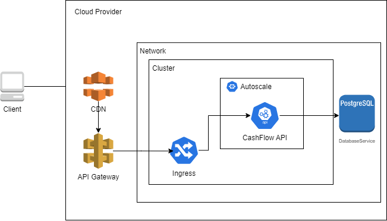

# CashFlow

O projeto tem como objetivo atender a um comércio, recebendo lançamentos e disponibilizando relatórios diários.

## Arquitetura

## Requisitos

- Docker (https://docs.docker.com/engine/install/)
- Docker-Compose (https://docs.docker.com/compose/install/)

## Rodando local

Execute a aplicação através do docker-compose:

   `docker-compose up app`

Accesse a aplicação através da porta 8081 (http://localhost:8081)
O swagger também estará disponível através do endereço http://localhost:8081/docs

## Rodando testes unitários

Rode o comando através do docker-compose:

   `docker-compose up unit-tests`

## Rodando lint

Rode o comando através do docker-compose:

   `docker-compose up lint`